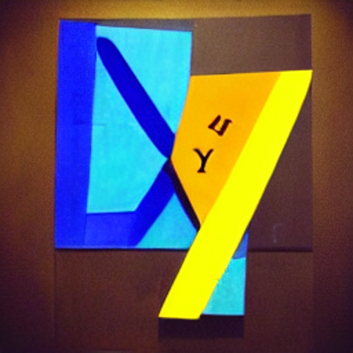

# XYZ Styled Region

An extension that allows you to apply custom styles to marked regions in your code. Enhance your coding experience with visually appealing regions, making it easier to read, debug, and navigate your code.

## Features

- Define and style regions with customizable properties.
- Activate or deactivate styling easily from the command palette.
- Styles are applied in real-time when you modify your code.

## Example


## Installation

1. Open VS Code.
2. Go to the Extensions view by clicking on the square icon on the sidebar or pressing `Ctrl+Shift+X` on Windows or `Cmd+Shift+X` on MacOS.
3. Search for "XYZ Styled Region".
4. Install and reload VS Code.
5. This extension is activated by default. Disable the extension to deactivate it.

## Usage

1. Define your regions in the code using a style block. Begin a style block with `.<STYLE_NAME>` or `.<STYLE_NAME>:beg` and end it with `.<STYLE_NAME>~` or `.<STYLE_NAME>:end`. Replace `<STYLE_NAME>` with a style you defined in `settings.json`.

```dart
  //.note:beg
  // This extension really helps programmers with very a visual mind
  //.note:end

  //.error
  int a = -1;
  //.error~

  //.deprecated
  @deprecated
  String doStuff() { }
  //.deprecated~
```

**Note:** The style definition format supports `//`, `///`, `#` and `##` comments.

2. Add an entry to `.vscode/settings.json` to define your styles. You may copy the following styles:

```json
"xyz.styledRegion.styles": {
    "example-style": {
        "border": "2px solid red", // Defines the border of the region
        "outline": "1px dashed blue", // Outlines the region
        "color": "green", // Text color
        "backgroundColor": "#f2f2f2", // Background color
        "fontWeight": "bold", // Text weight
        "fontStyle": "italic", // Text style (italic, oblique)
        "textDecoration": "underline wavy purple", // Text decoration (underline, overline, line-through)
        "letterSpacing": "2px", // Spacing between letters
        "opacity": "0.5", // Opacity, 0 is invisible, 1 is fully visible
        "borderRadius": "5px", // Rounded corners for the border
        "cursor": "pointer", // Cursor when hovering over the region
        "margin": "5px 0px", // Margin around the region (top/bottom)
        "padding": "5px", // Space between the content and the border/outline
        "overviewRulerColor": "blue", // Color of the mark in the overview ruler next to the scrollbar
        "gutterIconPath": "path_to_icon", // Shows an icon in the gutter
        "gutterIconSize": "contain", // Size of the gutter icon. Can be 'contain', 'auto', or a percentage
        "before": { // Adds content before each line in the region
            "contentText": "=> ", // Text to be added before
            "color": "blue" // Color for the 'before' content
        },
        "after": { // Adds content after each line in the region
            "contentText": " <=", // Text to be added after
            "color": "red" // Color for the 'after' content
        }
    },
    "title": {
        "backgroundColor": "#00ff000c",
        "isWholeLine": true
    },
    "header": {
        "backgroundColor": "#00ff000c",
        "isWholeLine": true,
        "before": {
            "contentText": "// ▓▓▓▓▓▓▓▓▓▓▓▓▓▓▓▓▓▓▓▓▓▓▓▓▓▓▓▓▓▓▓▓▓▓▓▓▓▓▓▓▓▓▓▓▓▓▓▓▓▓▓▓▓▓▓▓▓▓▓▓▓▓▓▓▓▓▓▓▓▓▓▓▓▓▓▓▓"
        },
        "after": {
            "contentText": "// ▓▓▓▓▓▓▓▓▓▓▓▓▓▓▓▓▓▓▓▓▓▓▓▓▓▓▓▓▓▓▓▓▓▓▓▓▓▓▓▓▓▓▓▓▓▓▓▓▓▓▓▓▓▓▓▓▓▓▓▓▓▓▓▓▓▓▓▓▓▓▓▓▓▓▓▓▓"
        }
    },
    "note": {
        "color": "#a6a6a6",
        "backgroundColor": "#1a1a1a1a",
        "isWholeLine": true,
        "outline": "1px dashed #a6a6a64d",
        "before": {
            "contentText": "\n"
        }
    },
    "letter": {
        "color": "#000000",
        "backgroundColor": "#ffffffcc",
        "isWholeLine": true,
        "outline": "1px dashed black"
    },
    "todo": {
        "opacity": "0.7",
        "textDecoration": "underline",
        "backgroundColor": "#ffffff0d",
        "isWholeLine": true
    },
    "deprecated": {
        "opacity": "0.7",
        "textDecoration": "line-through"
    },
    "error": {
        "opacity": "0.7",
        "backgroundColor": "#ff00000d",
        "fontWeight": "bold",
        "isWholeLine": true
    },
    "fixme": {
        "opacity": "0.7",
        "backgroundColor": "#ffff000d",
        "fontStyle": "italic",
        "isWholeLine": true
    },
    "do-not-modify": {
        "opacity": "0.7",
        "backgroundColor": "#0d7fff0d",
        "isWholeLine": true
    },
    "red": {
        "color": "#ff7f7f80",
        "backgroundColor": "#ff7f7f0d",
        "isWholeLine": true
    },
    "green": {
        "color": "#7fff7f80",
        "backgroundColor": "#7fff7f0d",
        "isWholeLine": true
    },
    "blue": {
        "color": "#0d7fff80",
        "backgroundColor": "#0d7fff0d",
        "isWholeLine": true
    },
    "yellow": {
        "color": "#ffff7f80",
        "backgroundColor": "#ffff7f0d",
        "isWholeLine": true
    },
    "brown": {
        "color": "#a6756380",
        "backgroundColor": "#a675630d",
        "isWholeLine": true
    },
    "orange": {
        "color": "#ffbf7f80",
        "backgroundColor": "#ffbf7f0d",
        "isWholeLine": true
    },
    "purple": {
        "color": "#bf7fff80",
        "backgroundColor": "#bf7fff0d",
        "isWholeLine": true
    },
    "pink": {
        "color": "#ffbfdf80",
        "backgroundColor": "#ffbfdf0d",
        "isWholeLine": true
    },
    "cyan": {
        "color": "#7fffff80",
        "backgroundColor": "#7fffff0d",
        "isWholeLine": true
    },
    "magenta": {
        "color": "#ff7fff80",
        "backgroundColor": "#ff7fff0d",
        "isWholeLine": true
    },
    "teal": {
        "color": "#7fbfbf80",
        "backgroundColor": "#7fbfbf0d",
        "isWholeLine": true
    },
    "lime": {
        "color": "#7fe63380",
        "backgroundColor": "#7fe6330d",
        "isWholeLine": true
    }
}
```

## Contributing

```zsh
# Clone the repository.
git clone https://github.com/robmllze/xyz_styled_region.git
# Install the dependencies.
npm install
```

Test your changes by running and submit a pull request.

## Known Issues

- The extension gets enabled on startup. This is apparently bad for performance.
- The `xyz-styled-region.activate` and `xyz-styled-region.deactivate` commands do not appear.
- Currenly the only way to deactivate the extension is to disable it in VS Code.

## Issues & Feedback

If you encounter any issues or want to give feedback, feel free to open an issue on the GitHub repository.

## License

This extension is licensed under the [MIT License](LICENSE).

## Other Cool Packages

- Rename files and folders in your project in bulk with [XYZ Bulk Rename](https://marketplace.visualstudio.com/items?itemName=robmllze.xyz-bulk-rename)
- Easily hide files and folders that are listed in your project's `.hideme` file. [XYZ .hideme](https://marketplace.visualstudio.com/items?itemName=robmllze.xyz-hideme)

